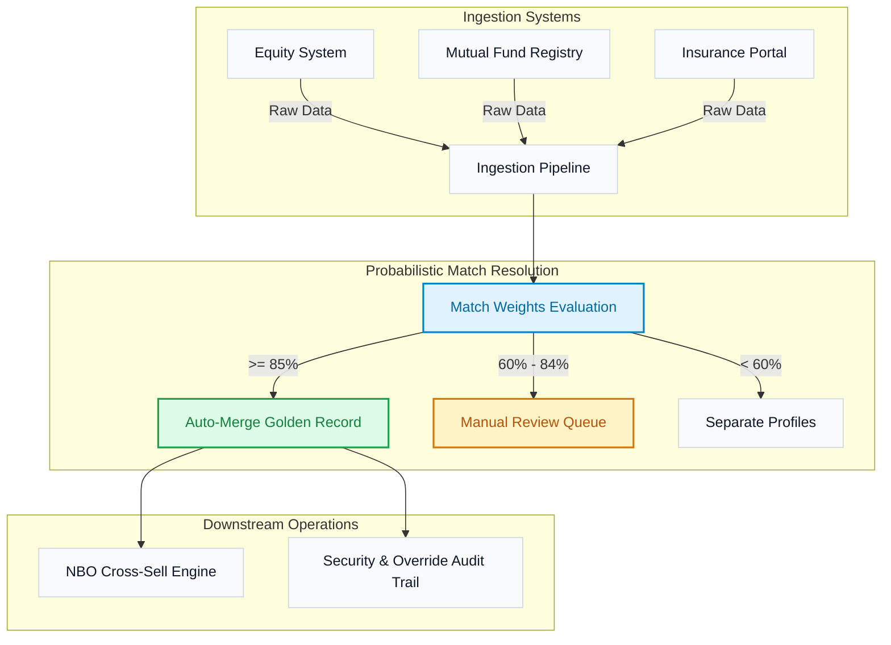

# Unified Financial Customer 360 & Next-Best-Opportunity Engine
## Global Architecture, Page-by-Page Feature Matrix, and Operational Playbook

---

## 1. The Financial Problem & Core Platform Value

Modern retail and wealth management institutions operate on independent, siloed database systems:
* **Equity Brokerage Core**: Tracks active demat accounts, trading volume, and equity portfolio valuations.
* **Mutual Fund Registry**: Tracks systemic investment plans (SIPs), recurring portfolios, and lump-sum investments.
* **Insurance Shield System**: Handles policy numbers, premiums, term values, and coverage terms.
* **Credit & Loans Ledger**: Tracks liabilities, credit cards, mortgages, and overdraft balances.
* **Private Wealth Division**: Handles high-net-worth individual (HNI) asset upgrades and custom investments.

Because these databases do not natively share a primary key, a single human client (e.g. *Rahul Sharma*) appears as five different entities across these systems. 

This platform solves this problem by using a **Weighted Probabilistic Identity Resolution Engine** to consolidate duplicates into one unified **Golden Record**, and runs a **Next-Best-Opportunity (NBO) Engine** to cross-sell financial products directly to the client based on their aggregated total relationship value (TRV).

---

## 2. Platform Architecture & Match Decision Boundaries



### The Identity Evaluation Weight Matrix
The engine assigns scores based on the reliability of matched fields:
1. **Permanent Account Number (PAN)** [Weight: 40 points]: The primary regulatory financial identifier.
2. **Mobile Number** [Weight: 25 points]: The primary contact coordinate.
3. **Email Address** [Weight: 15 points]: Secondary contact channel.
4. **Date of Birth (DOB)** [Weight: 10 points]: Checks biological profile consistency.
5. **Customer Name** [Weight: 7 points]: Normalized via Jaro-Winkler string similarity.
6. **City** [Weight: 3 points]: Local validation weight.

---

## 3. Comprehensive Page-by-Page Rendering & Feature Index

---

### Page 1: LoginPage (Security Gate & Mock Credential Helper)
* **What is Rendered on the Screen**:
  * **Brand Header Banner**: Contains the logo of the platform and a security indicator badge showing "Clearance Level: Active TLS Enforced".
  * **Secure Input Form**:
    * **Email Input Field**: Standard text box styled with thin blue active borders.
    * **Password Input Field**: Password mask input with toggle visibility button.
    * **"Sign In" Button**: A primary blue button that transitions on hover.
  * **Demo Credentials Panel**: A high-density expandable panel at the bottom displaying cards for the three mock roles. Clicking a card auto-fills the login form.
* **What each component indicates**:
  * **Login Errors**: High-contrast red alert box appears if credentials fail or if the account is locked.
  * **Clearance Level Indicator**: Reminds the user that their operations are logged.
* **Connected API Endpoints**:
  * `POST /api/auth/login`: Submits email and password, returning a JWT token containing role permissions.

---

### Page 2: DashboardPage (Global Operations Telemetry)
* **What is Rendered on the Screen**:
  * **Header Greeting Panel**: Displays the active user’s role, region, and security clearance level.
  * **Five KPI Stat Cards**:
    1. **Golden Records Card**: Total consolidated profiles (e.g. `1,245`). Indicates deduplication efficiency.
    2. **Auto-Merge Rate Card**: Percentage of records matching above the 85% threshold (e.g. `68%`).
    3. **System Mismatches Card**: Count of pending items in the fuzzy match review queue (e.g. `14`). Indicates compliance work backlog.
    4. **Active Propensities Card**: Count of qualified opportunities with estimated pipeline value.
    5. **Aggregated TRV Card**: Sum of all assets under management (AUM) held by the bank.
  * **Split-Pane Grid Section**:
    * **Left: Silo Product Holdings (Recharts Bar Chart)**: Consists of vertical color-coded bars indicating the count of accounts held per silo.
    * **Right: Priority Customer Registry (Table)**: Lists the top 3 high-value profiles, showing their identifier, name, active source systems (source badges), and relationship value. Clicking the "Explore All" button routes to the registry page.
* **What each component indicates**:
  * **Bar Colors**: System-level color coding (Blue for Core Equity, Green for Wealth, Amber for Loans).
  * **Source Badges**: Visually map which source databases contributed to each consolidated customer record.
* **Connected API Endpoints**:
  * `GET /api/dashboard/stats`: Returns system telemetry, product breakdowns, and pipeline valuations.

---

### Page 3: CustomerListPage (Unified Customer Registry)
* **What is Rendered on the Screen**:
  * **Title Header Panel**: Displays the title and total record count badge.
  * **Interactive Filters Bar**:
    * **Search Bar**: Real-time text search for names, PANs, emails, or phone numbers.
    * **Source System Dropdown**: Dropdown filter to view customers matching specific silos (e.g., Equity only).
    * **Segment Dropdown**: Filter by tier (HNI, Mass Affluent, Retail Prime).
    * **"Has Opportunities" Checkbox**: Toggles view to show only customers with qualified cross-sell leads.
  * **Data Table Grid**: Renders customer columns (Golden ID, Name & Segment, Masked PII details, Ingested Sources, total relationship value, and matching confidence rating).
  * **Pagination Footer Bar**: Page controls showing active page number, total count, and page size dropdown selector (10, 25, 50 rows).
* **What each component indicates**:
  * **Masked PII**: PANs and Mobile numbers are partially masked (e.g. `XXXXXX1234`) to comply with privacy laws (GLBA/GDPR).
  * **Confidence Badge**: Uses emerald colors for high confidence (>90%), amber for medium, and red for low match scores.
* **Connected API Endpoints**:
  * `GET /api/customers`: Processes search, pagination, segment, and system filters.

---

### Page 4: CustomerProfilePage (The 360-Degree Golden Dossier)
This page is split into **six highly specialized tabs** to organize information efficiently:

```
+-----------------------------------------------------------------------+
|  Rahul Sharma  |  Golden ID: G-87612  |  Total Asset Value: ₹85,50,000  |
+-----------------------------------------------------------------------+
| [Overview]  [Identity Evidence]  [Conflicts]  [Opportunities]  [Lineage]  [Notes] |
+-----------------------------------------------------------------------+
|                                                                       |
|  Active tab content renders here (scrolls independently)             |
|                                                                       |
+-----------------------------------------------------------------------+
```

#### Tab 4.1: Overview Tab
* **What is Rendered**:
  * **Product Holdings Strip (`ProductStrip.tsx`)**: High-contrast grid cards detailing checking, loan, mutual fund, demat, and insurance holdings.
  * **Asset Allocation Chart**: A proportional donut chart showing distribution of wealth.
* **Indication**: RMs scan this to quickly assess the client's asset mix and identify missing product types.

#### Tab 4.2: Identity Evidence Tab
* **What is Rendered**:
  * **Match Rationale Table**: Lists PII attributes side-by-side (source system values) with matching score weights and similarity outcomes (e.g., matching address, conflicting phone).
* **Indication**: Explains why the engine consolidated this customer profile.

#### Tab 4.3: Conflicts Tab
* **What is Rendered**:
  * **Attribute Conflict Card (`AttributeConflictCard.tsx`)**: Displays fields where source databases contradict each other (e.g., `rahul.s@gmail.com` in Equity vs. `rahul@gmail.com` in Mutual Funds).
  * **Admin Override Console Button**: Triggers a modal for Data Admins to select the authoritative value.
* **Indication**: Shows data quality issues that need manual resolution.

#### Tab 4.4: Opportunities Tab
* **What is Rendered**:
  * **Cross-Sell Opportunity Ranks**: Lists algorithmic product offers (e.g. SIP Wealth Upgrade) sorted by priority propensity score.
  * **Rule Eligibility Checklist**: Highlights which logic parameters (e.g. account age > 1 year) were met.
  * **"Initiate Pitch" Button**: Changes status to "In Progress" and logs the activity.
* **Indication**: Shows matched products waiting for RM action.

#### Tab 4.5: Source Lineage Tab
* **What is Rendered**:
  * **Lineage Node Diagram**: Shows the flow of data from ingestion staging up to consolidation.
  * **Extraction Metadata Details**: Displays execution timestamps, source system API formats, and match similarity scores.
* **Indication**: Used by data engineers to trace raw API payload extractions back to their original database tables.

#### Tab 4.6: Notes & Activity Journal Tab
* **What is Rendered**:
  * **Relationship Activity Journal**: Form for RMs to save meeting notes, call logs, and pitch responses.
  * **Governance Activity Stream**: A chronological timeline tracking configuration changes, overrides, or manual merges.
* **Indication**: Provides a transparent history of client interactions and administrative changes.

---

### Page 5: ReviewQueuePage (The Compliance Desk)
* **What is Rendered on the Screen**:
  * **Review Backlog Counters**: 3 cards showing pending, dangerous, and resolved items.
  * **Master-Detail Layout Panel**:
    * **Left List Rail**: Cards representing pending customer pairs, displaying matching confidence score and a red alert if a critical identifier conflicts.
    * **Right Detail Panel**: Displays `ReviewComparisonCard.tsx` showing side-by-side values, similarity percentages, an input comment box, and **"Approve Merge"** / **"Separate Entities"** buttons.
* **What each component indicates**:
  * **Green Row**: Attributes match.
  * **Red Row**: Attributes conflict.
* **Connected API Endpoints**:
  * `GET /api/review`: Returns pending match reviews.
  - `POST /api/review/:id/decide`: Submits the operator's decision (Merge or Separate) with reasoning notes.

---

### Page 6: OpportunitiesPage (The Revenue Pipeline)
* **What is Rendered on the Screen**:
  * **Cross-Sell Summary Cards**: Total qualified leads, estimated pipeline value, and conversion rates.
  * **Lead Workspace (Table or Grid View)**:
    * **Table View**: Rows detailing opportunity ID, client name, matched target product, propensity score, estimated value, and status badge.
    * **Grid View**: Opportunity cards showing key eligibility rules and action buttons.
* **What each component indicates**:
  * **Status Badges**: `NEW` (untouched), `IN PROGRESS` (under discussion), `CONVERTED` (closed-won), or `DISMISSED` (archived).
* **Connected API Endpoints**:
  * `GET /api/opportunities`: Returns opportunities matching active filters.
  * `PATCH /api/opportunities/:id/status`: Updates lead lifecycle status.

---

### Page 7: ConfigurationPage (Global System Settings)
* **What is Rendered on the Screen**:
  * **Weight Modifiers Console**: Drag sliders (0-100 pts) for PAN, DOB, Email, Mobile, Name, and City.
  * **Threshold Settings Panel**: Input boxes to configure the Auto-Merge boundary (e.g. 85%) and Fuzzy Review boundary (e.g. 60%).
  * **NBO Cross-Sell Rules Table**: Shows active business rules, logic parameters, and target products.
* **What each component indicates**:
  * **Slider Handles**: Indicate relative matching weights. Adjusting them triggers a real-time recalculation of match results.
* **Connected API Endpoints**:
  * `GET /api/config`: Returns active configurations.
  - `PUT /api/config`: Updates parameters and triggers profile re-evaluation.

---

### Page 8: AuditLogPage (The Immutable Log)
* **What is Rendered on the Screen**:
  * **System Events Grid**: Logs all administrative and security actions. Columns include Audit ID, Timestamp, Action Category, Actor Details (Role/Email), Target ID, and Description.
  * **Filter Bar**: Categories include `CONFIG` (weight modifications), `OVERRIDE` (value adjustments), `MERGE` (manual queue decisions), and `UNAUTHORIZED` (access violations).
* **What each component indicates**:
  * **Actor Roles**: Displays role tags (e.g. `[ADMIN]` in red, `[RM]` in green) to indicate who initiated the action.
* **Connected API Endpoints**:
  * `GET /api/audit`: Returns security logs.

---

### Page 9: UnauthorizedPage (Route Access Violation Alert)
* **What is Rendered on the Screen**:
  * **Access Denied Dialog**: Renders a red shield icon, a warning title, and an explanation of the permission boundary.
  * **"Return to Safety" Button**: Routes the user back to the main dashboard.
* **Indication**: Appears if a Relationship Manager attempts to access the System Configuration Page.

---

## 4. Role Permission Matrix & Strategic Value

Here is how each role operates on the platform to solve data challenges and drive cross-sell revenue:

| Action / Capability | Data Admin | Branch Manager | Relationship Manager |
| :--- | :---: | :---: | :---: |
| **System Settings (Weights & Rules)** | ✅ Full Access | ❌ Read-Only | ❌ No Access |
| **Field Overrides (Conflict Resolution)** | ✅ Full Access | ✅ Full Access | ❌ No Access |
| **Approve / Reject Merges** | ✅ Full Access | ✅ Full Access | ✅ Assigned Only |
| **Action Opportunities (Cross-sell Pitch)** | ❌ No Access | ✅ Read-Only | ✅ Full Access |
| **Security Audit Trail** | ✅ Read-Only | ✅ Read-Only | ❌ No Access |

---

### 👤 Role A: Data Admin (Devraj Kapoor)
* **Role Objective**: Maintain data integrity, adjust matching criteria, audit unauthorized access events, and configure business rules.
* **How They Use the Platform**:
  * **Adjust Sensitivity**: If false merges occur, they navigate to the **System Config** tab and increase the match weight for PAN.
  * **Audit System Integrity**: They regularly check the **Audit Logs** to review manual override decisions.
  * **Resolve Data Conflicts**: When source databases contradict each other, they use the **Conflicts** tab to select the authoritative value.

---

### 👥 Role B: Branch Manager (Sunita Deshmukh)
* **Role Objective**: Oversee compliance review operations, allocate resources, and check regional pipeline value.
* **How They Use the Platform**:
  * **Process Backlogs**: They review the **Fuzzy Match Queue** to verify and resolve borderline customer profiles.
  * **Oversee Sales Pipelines**: They track opportunities across their team to monitor pipeline value.

---

### 💼 Role C: Relationship Manager (Arjun Mehta)
* **Role Objective**: Drive product sales, pitch customized offerings, and maintain high client engagement.
* **How They Use the Platform**:
  * **Verify Portfolio Allocation**: They review the **Asset Allocation Donut Chart** to identify missing products (e.g., insurance).
  * **Pitch Products**: They use the **Opportunities** tab to view qualified leads, access pitch scripts, and initiate sales calls.
  * **Log Client Meetings**: They use the **Notes & Activity** tab to record client responses.

---

## 5. Step-by-Step Operator Playbook

---

### Play 1: Authenticate and Navigate
1. Navigate to the login page (`http://localhost:3000/`).
2. Go to the **Demo Credentials helper panel** at the bottom of the screen.
3. Click on the profile card for **Devraj Kapoor (Data Admin)**, then click **Sign In**.
4. Confirm you are logged in by checking the badge in the top right corner.

---

### Play 2: Resolve Conflicting PII Records (Data Admin)
1. Navigate to the **Customer Registry** page.
2. In the Search Bar, search for "Rahul Sharma" and click on his record.
3. Go to the **Conflicts** tab. You will see a conflict on "Email Address" between the Equity and Mutual Fund systems.
4. Click **Override Value**. Select `rahul@gmail.com` as the authoritative record, choose `Equity` as the authoritative system, write *"Confirmed during live call"* in the reasoning box, and click **Confirm Override**.
5. Go to the **Notes & Activity** tab and verify the audit event has been written to the ledger.

---

### Play 3: Verify and Resolve Borderline Matches (Branch Manager)
1. Log out, select **Sunita Deshmukh (Branch Manager)** in the helper panel, and click **Sign In**.
2. Go to the **Review Queue** tab.
3. Click on the top review item (a fuzzy match showing a 78% confidence score).
4. Review the details in the comparison panel. Since the name and mobile numbers match, type *"KYC documents verified"* in the comment field and click **Approve Merge**.
5. The matching record is consolidated into a single Golden Record in the registry database.

---

### Play 4: Pitch Opportunities and Log Interactions (Relationship Manager)
1. Log out, select **Arjun Mehta (Relationship Manager)** in the helper panel, and click **Sign In**.
2. Navigate to the **Opportunities** page.
3. Locate the **Term Insurance Plan** opportunity for Rahul Sharma. Review the eligibility checklist.
4. Click **Initiate** to update the status to "In Progress".
5. Call the client and explain the offer. 
6. Go to the client's profile page and select the **Notes & Activity** tab. Write *"Emailed Rahul term insurance brochure during quarterly portfolio review. Client scheduled call for next Monday."* Click **Save Log**.
7. Once the product is sold, return to the opportunities table and click **Convert** to record the sale.
